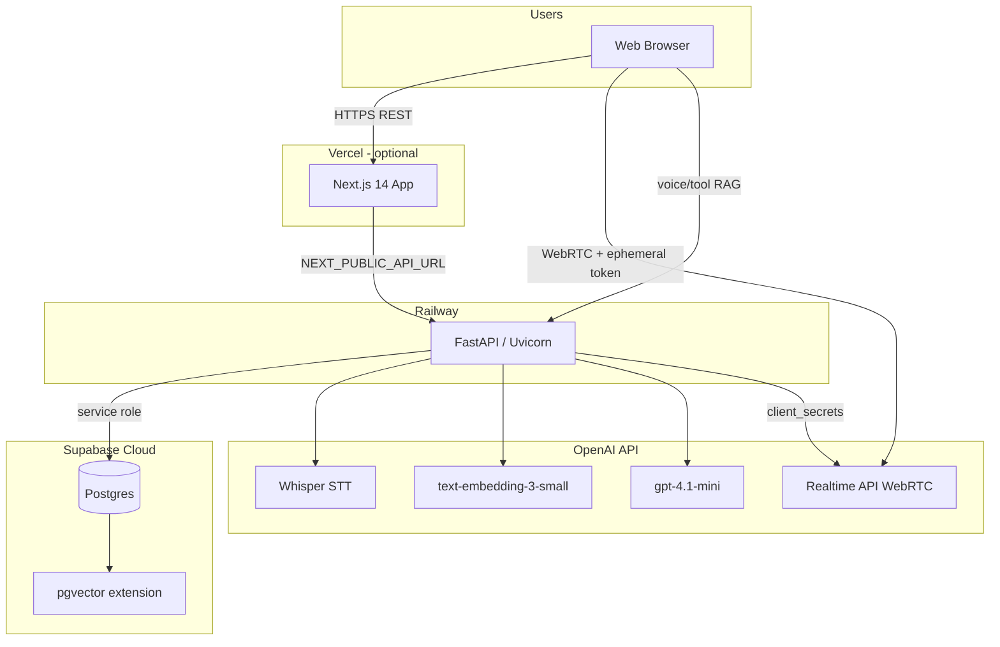
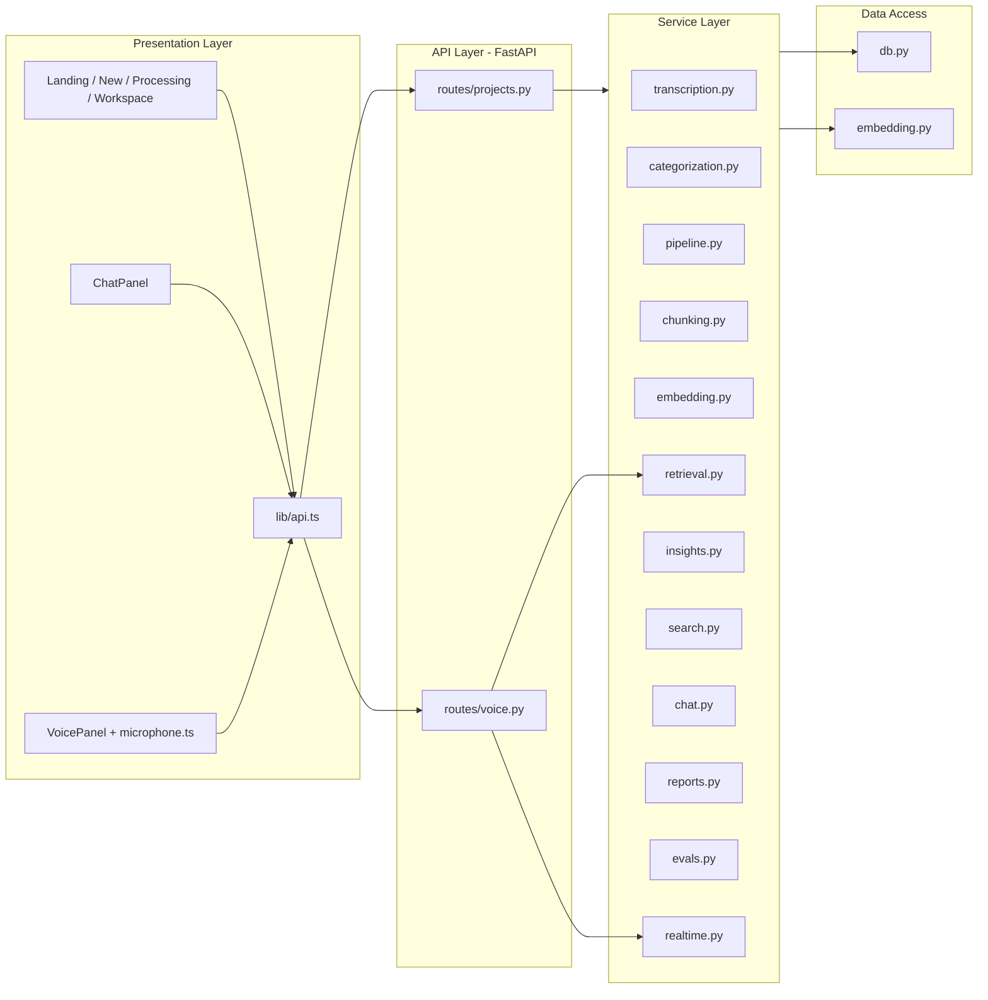
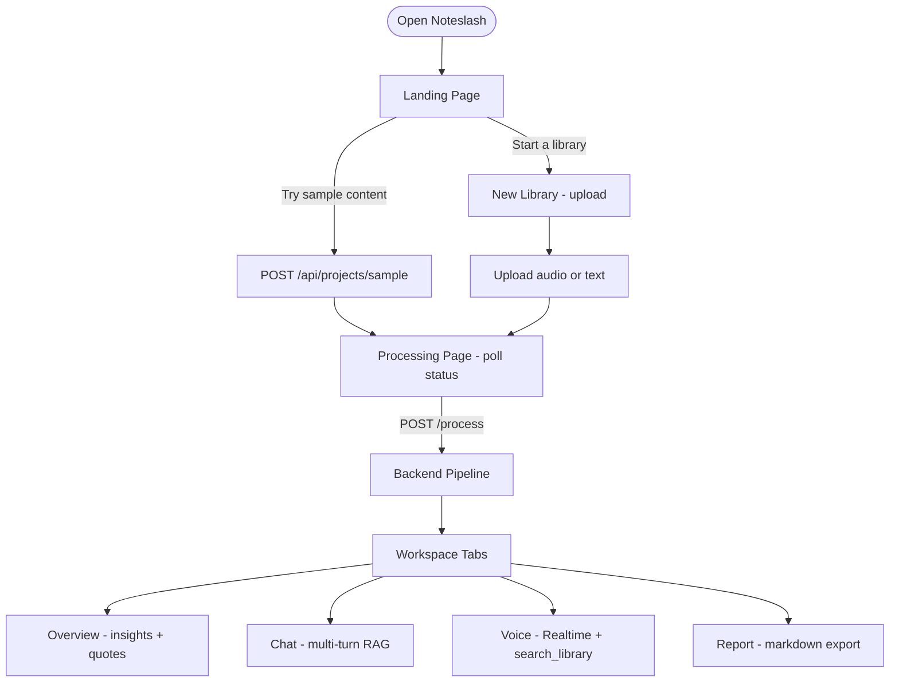
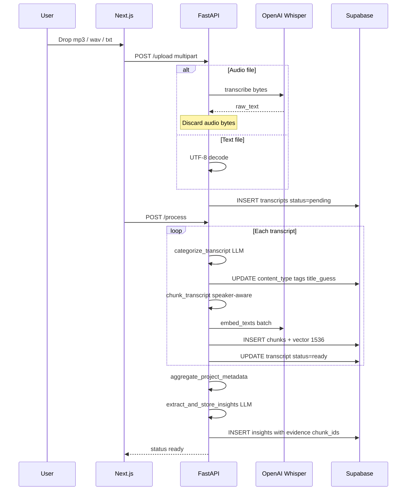
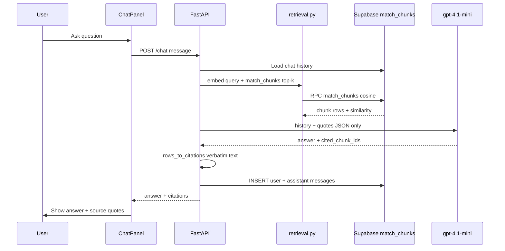
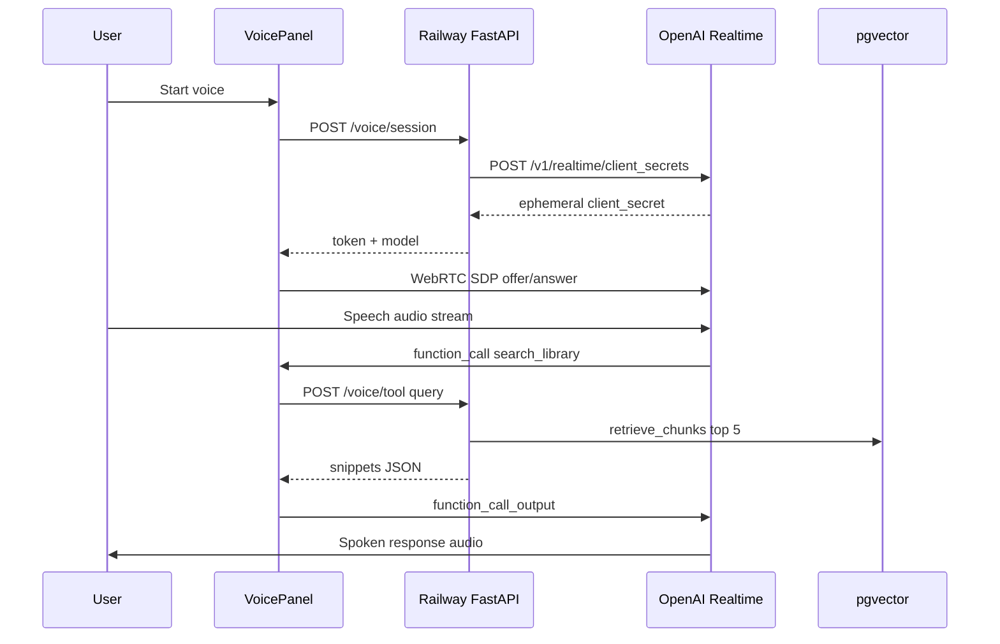
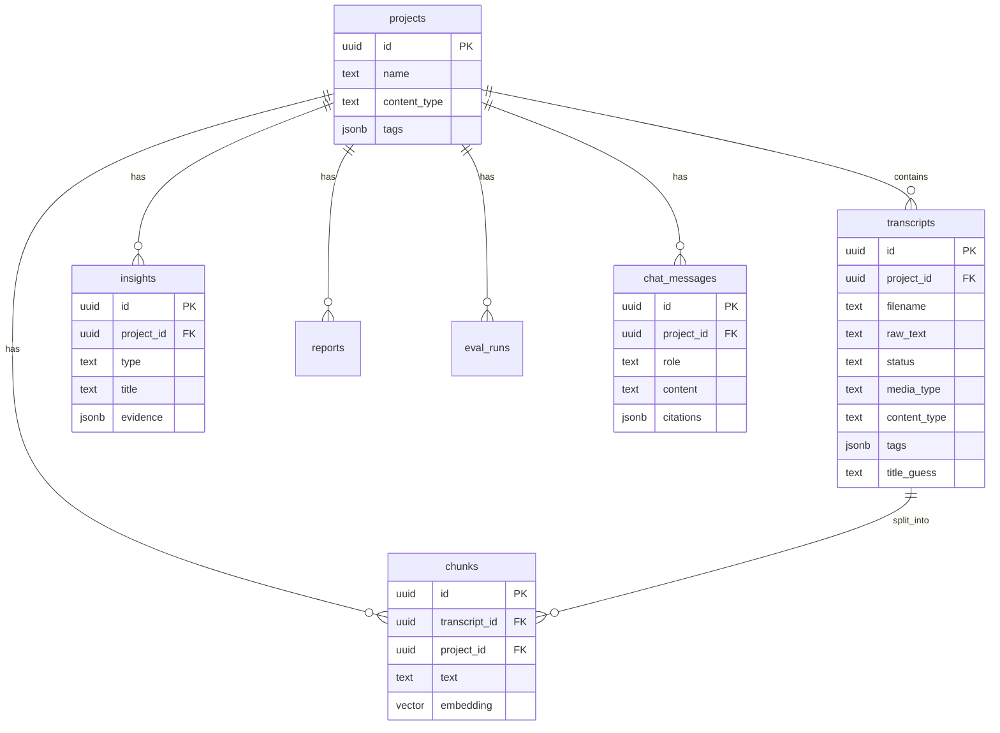

# Noteslash — System Architecture

Technical reference for the Noteslash platform. Repository: [github.com/sudhersankv/noteslashv2](https://github.com/sudhersankv/noteslashv2)

---

## 1. What Noteslash does (30-second pitch)

**Noteslash** turns any audio or text into a **searchable library** with **cited answers**. Upload podcasts, audiobooks, interviews, or `.txt` files → transcribe → categorize → index → explore via **Overview**, **Chat**, **Voice**, or **Report**.

Every AI answer is grounded in **real passages** stored in your database—not invented quotes.

---

## 2. Production deployment topology



| Component | Technology | Role |
|-----------|------------|------|
| **Frontend** | Next.js 14, React, TypeScript, Tailwind | UI, guided flow, WebRTC voice client |
| **Backend** | FastAPI, Python 3.11+ | REST API, AI orchestration, no secrets in browser |
| **Database** | Supabase (hosted Postgres) | Projects, transcripts, chunks, vectors, insights |
| **Vector search** | pgvector + `match_chunks` RPC | Semantic retrieval (1536-dim cosine) |
| **Speech-to-text** | OpenAI Whisper (`whisper-1`) | On upload; audio bytes discarded |
| **LLM** | `gpt-4.1-mini` | Categorize, insights, chat, search, report, eval judge |
| **Voice** | OpenAI Realtime (`gpt-4o-realtime-preview`) | Full-duplex speech; RAG via `search_library` tool |

**Secrets:** `OPENAI_API_KEY`, `SUPABASE_URL`, `SUPABASE_SERVICE_ROLE_KEY` live only on **Railway** (backend). Frontend only has `NEXT_PUBLIC_API_URL`.

---

## 3. Logical architecture (layers)



---

## 4. User journey



| Step | Route | What happens |
|------|-------|----------------|
| 1 | `/` | Product story, 4-step guide |
| 2 | `/new` or sample CTA | Create project, upload files |
| 3 | `/project/{id}/processing` | Sync process + status polling |
| 4 | `/project/{id}` | Overview \| Chat \| Voice \| Report |

---

## 5. Upload and ingestion pipeline (core differentiator)

Audio is transcribed **at upload time** (not during `/process`). Original audio is **not stored**—only text in Postgres.



### Processing stages (show on processing page)

1. **Transcribing audio** — already done on upload for audio; text skips this
2. **Categorizing content** — LLM assigns `podcast | interview | audiobook | lecture | other` + tags
3. **Indexing library** — chunk + embed + pgvector
4. **Extracting insights** — themes / quotes / takeaways (prompt varies by `content_type`)

**Key files:**

| Stage | File |
|-------|------|
| Upload + Whisper | [`backend/app/routes/projects.py`](../backend/app/routes/projects.py), [`transcription.py`](../backend/app/services/transcription.py) |
| Categorize | [`categorization.py`](../backend/app/services/categorization.py) |
| Chunk | [`chunking.py`](../backend/app/services/chunking.py) |
| Embed | [`embedding.py`](../backend/app/services/embedding.py) |
| Pipeline orchestration | [`pipeline.py`](../backend/app/services/pipeline.py) |
| Insights | [`insights.py`](../backend/app/services/insights.py), [`prompts.py`](../backend/app/agents/prompts.py) |

---

## 6. Semantic search and RAG (Chat + Search)



**Citation rule:** UI displays `chunk.text` from the database—never model-paraphrased “quotes.”

| Component | File |
|-----------|------|
| Vector retrieval | [`retrieval.py`](../backend/app/services/retrieval.py) |
| Chat orchestration | [`chat.py`](../backend/app/services/chat.py) |
| Citation builder | [`citations.py`](../backend/app/services/citations.py) |
| SQL RPC | [`002_initial_schema.sql`](../supabase/migrations/002_initial_schema.sql) — `match_chunks()` |

---

## 7. Voice-to-voice (Realtime + grounded tool)

Browser connects **directly** to OpenAI via WebRTC. RAG runs on **your Railway backend** so the API key stays server-side.



| Piece | File |
|-------|------|
| Session creation | [`realtime.py`](../backend/app/services/realtime.py), [`voice.py`](../backend/app/routes/voice.py) |
| WebRTC client | [`voice-panel.tsx`](../frontend/components/voice-panel.tsx) |
| Mic helpers | [`microphone.ts`](../frontend/lib/microphone.ts) |

**Production note:** Microphone requires **HTTPS** (Vercel/Railway public URLs). `microphone.ts` blocks insecure contexts.

---

## 8. Database schema (ER diagram)



**Migrations (run in order):**

1. `001_enable_pgvector.sql`
2. `002_initial_schema.sql`
3. `003_noteslash_audio.sql` — `media_type`, `content_type`, `tags`

---

## 9. REST API map

| Method | Endpoint | Purpose |
|--------|----------|---------|
| GET | `/health` | Liveness |
| POST | `/api/projects` | Create library |
| POST | `/api/projects/sample` | Seed 3 sample transcripts |
| POST | `/api/projects/{id}/upload` | Audio → Whisper or text; store transcript |
| POST | `/api/projects/{id}/process` | Categorize → chunk → embed → insights |
| GET | `/api/projects/{id}/status` | Poll processing state |
| GET | `/api/projects/{id}/insights` | Overview data |
| POST | `/api/projects/{id}/search` | One-shot semantic Q&A |
| POST | `/api/projects/{id}/chat` | Multi-turn chat + citations |
| GET | `/api/projects/{id}/chat` | Chat history |
| POST | `/api/projects/{id}/voice/session` | Realtime ephemeral token |
| POST | `/api/projects/{id}/voice/tool` | `search_library` for voice agent |
| POST | `/api/projects/{id}/report` | Generate markdown report |
| GET | `/api/projects/{id}/report/latest` | Last report |
| POST | `/api/projects/{id}/evaluate` | Grounding score on insights |

---

## 10. Content-type behavior (podcast vs interview)

| `content_type` | Insight prompts | UI labels (Overview) |
|----------------|-----------------|----------------------|
| `interview` | themes, pain points, feature requests | Top themes / Pain points / Feature requests |
| `podcast`, `audiobook`, `lecture`, `other` | key topics, notable quotes, takeaways | Key topics / Notable quotes / Takeaways |

Same DB enum (`theme`, `pain_point`, `feature_request`); labels adapt via [`frontend/lib/labels.ts`](../frontend/lib/labels.ts).

---

## 11. Environment variables (Railway backend)

| Variable | Required | Purpose |
|----------|----------|---------|
| `OPENAI_API_KEY` | Yes | Whisper, embeddings, chat, realtime |
| `SUPABASE_URL` | Yes | Database |
| `SUPABASE_SERVICE_ROLE_KEY` | Yes | Server-side DB access |
| `CORS_ORIGINS` | Yes | Your Vercel/production frontend URL |
| `OPENAI_CHAT_MODEL` | No | Default `gpt-4.1-mini` |
| `OPENAI_WHISPER_MODEL` | No | Default `whisper-1` |
| `OPENAI_REALTIME_MODEL` | No | Default `gpt-4o-realtime-preview` |
| `OPENAI_TTS_VOICE` | No | Default `verse` |
| `MAX_AUDIO_SIZE_MB` | No | Default `25` |

**Frontend (Vercel):** `NEXT_PUBLIC_API_URL` = Railway public URL.

---

## 12. Repository layout

```
noteslashv2/
├── frontend/                 # Next.js app (deploy root on Vercel)
│   ├── app/                  # pages: /, /new, /project/[id], processing
│   ├── components/           # chat-panel, voice-panel, insight-card
│   └── lib/                  # api.ts, microphone.ts, labels.ts
├── backend/                  # FastAPI (deploy root on Railway)
│   ├── app/
│   │   ├── routes/           # projects.py, voice.py
│   │   ├── services/         # pipeline, transcription, chat, retrieval...
│   │   └── agents/prompts.py
│   ├── sample-data/          # bundled .txt for /sample endpoint
│   └── tests/
├── supabase/migrations/
└── docs/ARCHITECTURE.md
```

---

## 13. Design principles

1. **Media-agnostic intelligence** — same RAG stack for podcast, audiobook, or interview text.
2. **Transcribe once, discard audio** — lower storage cost; text is the source of truth.
3. **Citations from DB** — answers reference stored chunk text, not model-paraphrased quotes.
4. **Voice security** — Realtime token is ephemeral; RAG runs on the backend API.
5. **Sync processing** — suitable for small libraries; async jobs are the scale-up path.
